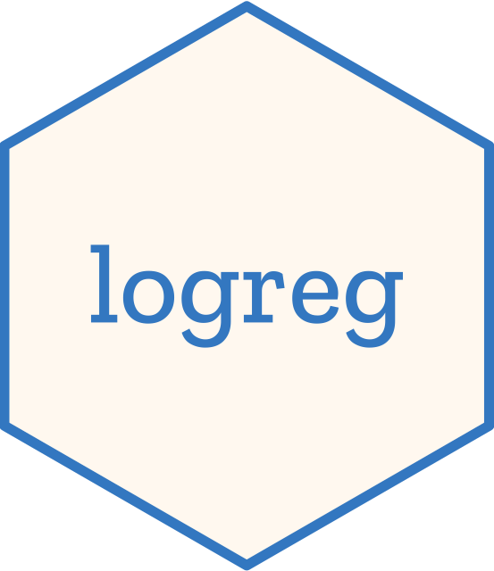

# logreg  <a href="https://nanx.me/logreg/"></a>

The `logreg` package implemented logistic regression and regularized logistic regression models with the computational graph and automatic differentiation framework provided by the R package [`cgraph`](https://github.com/triepels/cgraph).

Check out the [vignette](https://nanx.me/logreg/articles/logreg.html) or the [blog post](https://nanx.me/blog/post/cgraph-logreg/) for details.

## Installation

Install from GitHub:

```r
# install.packages("remotes")
remotes::install_github("nanxstats/logreg")
```

## License

logreg is free and open source software, licensed under MIT.
